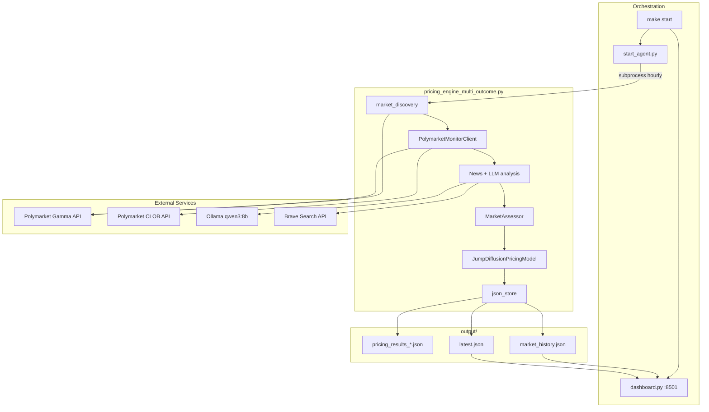

# Pricing Prediction Market Headlines 
The codebase employs a jump diffusion process to simulate probability paths over time, accounting for gradual drifts, sudden news-driven jumps, and decay toward resolution. Key outputs include fair probability, edge, Kelly fraction for position sizing, expected value, and risk-adjusted return, culminating in trade recommendations. This approach aims to exploit inefficiencies in illiquid or volatile markets by blending machine learning with agentic reasoning.

## Architecture

An hourly agent discovers top geopolitical Polymarket events, enriches them with news-driven LLM analysis, prices them with a jump-diffusion model, persists JSON snapshots, and serves results through a local Streamlit dashboard.

### System flow



### Per-market pipeline

Each hourly run processes up to 10 dynamically discovered markets through the following steps:

```mermaid
flowchart LR
    step1["Discover top-10 geopolitical slugs"]
    step2["Fetch market data + prices"]
    step3["Ollama generates search queries"]
    step4["Brave fetches news articles"]
    step5["Ollama analyzes news → AI prior"]
    step6["Classify market regime"]
    step7["Jump-diffusion Monte Carlo pricing"]
    step8["Save JSON snapshot + update history"]

    step1 --> step2 --> step3 --> step4 --> step5 --> step6 --> step7 --> step8
```



### Modules

| Module | Role |
|--------|------|
| `start_agent.py` | Hourly scheduler; subprocess runner |
| `pricing_engine_multi_outcome.py` | Main pipeline (production) |
| `pricing_engine.py` | Legacy binary-only engine |
| `market_discovery.py` | Dynamic Polymarket universe |
| `ollama_server.py` | Local LLM client |
| `json_store.py` | JSON persistence |
| `dashboard.py` | Streamlit UI |

### Data layout

All persisted output lives in `output/`:

- `pricing_results_YYYYMMDDTHHMMSSZ.json` — immutable snapshot from each run
- `latest.json` — always overwritten with the most recent run
- `market_history.json` — cross-snapshot index keyed by `market_id` for historical charts

## Quick Start
1. install Ollama
2. install qwen3:8b from Ollama
3. Start Ollama server
```bash
ollama serve
```

4. Start Agent
```bash
make start
```

5. Observe Historical data on local dashboard running at http://localhost:8501 
6. Track agent activity here: ./pricing-headlines-jump-diffusion-model/agent.log


## Jump Diffusion Pricing Process

The production engine in `pricing_engine_multi_outcome.py` combines **news-driven AI priors**, **regime classification**, and a **jump-diffusion probability model** to produce fair prices, edge, Kelly sizing, and trade signals for binary and multi-outcome Polymarket events.

### 1. **Market Data Fetch** → `PolymarketMonitorClient`
   - **`fetch_market_data(slug)`**: Gamma API (metadata, outcomes, prices) + CLOB API (price history, orderbook)
   - **`is_binary_market()`** / **`get_outcome_list()`**: detect binary Yes/No vs multi-outcome events
   - Events with >2 sub-markets are aggregated into a single synthetic market (e.g. Fed-chair nominee lists)

### 2. **News + AI Prior** → `generate_search_queries_for_question`, `search_news_for_question`, `analyze_question_with_news`
   - Ollama generates 2 targeted search queries per question
   - Brave Search fetches up to 10 news articles (30-day freshness window)
   - Ollama analyzes news → **binary**: `{prediction, confidence}` or **multi-outcome**: `{outcome_probabilities, confidence}`

   **Binary AI prior conversion** (`StrategyEngine.extract_ai_signal`):

   ```python
   confidence_map = {'Low': 0.1, 'Medium': 0.25, 'High': 0.5}
   prior = (1 - confidence) * 0.5 + confidence * prediction   # prediction ∈ {0, 1}
   ```

### 3. **Regime Classification** → `MarketAssessor`
   Compute market microstructure metrics from Polymarket liquidity, volume, and time-to-expiry:

   ```python
   # Implied vol proxy from estimated spread
   IV = spread / (2 * sqrt(TTE_days / 365)) * 100

   # Liquidity and volatility scores (0–100)
   liquidity_score = min(100, (liquidity_usd / 10000) * log1p(volume_24h / 100000))
   volatility_score = min(100, IV * 10)
   ```

   **Regime rules** (`classify_regime`):
   - Deep liquidity + low vol → `DEEP_LIQUIDITY`
   - Low liquidity → `ILLIQUID_TAIL`
   - Short TTE + high vol → `PRE_CATALYST`
   - Default → `HIGH_VOL_TRANSITIONAL`

   Each regime sets jump-diffusion parameters `(λ, σ_jump, θ)`:

   | Regime | λ (news intensity) | σ_jump | θ (decay) |
   |--------|---------------------|--------|-----------|
   | ILLIQUID_TAIL | 0.08 | 0.35 | 0.005 |
   | DEEP_LIQUIDITY | 0.25 | 0.15 | 0.002 |
   | Other | 0.15 | 0.25 | 0.003 |

### 4. **Posterior Blend** → `StrategyEngine.build_diffusion_model` (THE SETUP)
   Blend AI prior with market price, weighted by a simplified liquidity score:

   ```python
   liquidity_score = min(100, liquidity_usd / 10000)
   weight_ai = 0.7 * (1 - liquidity_score / 100)
   weight_market = 1 - weight_ai
   posterior = weight_ai * ai_prior + weight_market * market_price
   ```

   Returns a `ProbabilityDiffusionState` with regime-calibrated `(λ, jump_mean, jump_std, θ, drift_rate)`.

   **Key insight**: illiquid markets trust AI more; deep markets trust the order book more.

### 5. **Jump-Diffusion Simulation** → `ProbabilityDiffusionState.simulate_path` (THE MAGIC)
   Monte Carlo paths for probability evolution over time:

   ```python
   # Daily step (dt = 1/365)
   dW ~ N(0, sqrt(dt))
   diffusion = drift_rate * dt + jump_std * dW
   jumps ~ Poisson(news_intensity_lambda * dt)
   jump_sizes ~ N(jump_mean, jump_std)
   decay = -theta_decay * dt

   p_t = clip(p_{t-1} + diffusion + jumps * jump_sizes + decay, 0.001, 0.999)
   ```

   This captures gradual drift, Poisson news jumps, and mean-reversion toward resolution.

### 6. **Fair Price** → `JumpDiffusionPricingModel.calculate_fair_probability`
   Closed-form fair probability (used for pricing; Monte Carlo is also reported as `monte_carlo_10d` in binary output):

   ```python
   time_component = posterior * exp(-theta_decay * sqrt(TTE_years))
   jump_premium = news_intensity_lambda * jump_std ** 2
   liquidity_discount = max(0.01, 100 - liquidity_score) / 1000

   fair_prob = (time_component + jump_premium - liquidity_discount) * regime_multiplier
   fair_prob = clip(fair_prob, 0.001, 0.999)
   ```

   **Regime multipliers**: ILLIQUID_TAIL=0.85, DEEP_LIQUIDITY=1.02, PRE_CATALYST=0.90, HIGH_VOL=0.95

### 7. **Edge, Kelly, and Signals** → `JumpDiffusionPricingModel.price_market`

   ```python
   edge = fair_prob - market_price                    # in probability units
   edge_percentage = edge * 100                       # percentage points
   edge_bps = edge * 10000
   expected_value = edge * 100
   risk_adj_return = expected_value / (jump_std * 100)

   # Fractional Kelly (25% of full Kelly, scaled by AI confidence)
   if market_prob < fair_prob:
       odds = (1 / market_prob) - 1
       kelly = (odds * fair_prob - (1 - fair_prob)) / odds
   else:  # short Yes / long No
       odds = (1 / (1 - market_prob)) - 1
       kelly = (odds * (1 - fair_prob) - fair_prob) / odds
   kelly *= confidence * 0.25
   ```

   **Binary signal thresholds** (`PricingResult.recommendation`):
   - edge > 3% → `STRONG_SIGNAL`
   - edge > 1.5% → `MODERATE_SIGNAL`
   - edge > 0.5% → `WEAK_SIGNAL`
   - else → `NO_TRADE`

### 8. **Multi-Outcome Branch** → `price_multi_outcome_market`
   For events with >2 outcomes, each outcome is priced as an **independent binary event**:
   1. Take AI probability per outcome from `outcome_probabilities`
   2. Build per-outcome diffusion state via `build_diffusion_model_for_outcome`
   3. Run same fair-price / edge / Kelly pipeline
   4. Sort by `|edge|`; flag `BUY`/`SELL`/`PASS` (±1% edge); surface top 5 with edge > 0.5%

### 9. **Unified Pipeline** → `run_pricing_engine`
   Per slug in the hourly batch:
   1. Fetch market data
   2. Search news + run AI analysis
   3. Assess regime
   4. Price (binary or multi-outcome)
   5. Append to results
   6. `json_store.save_results_to_json()` writes snapshot + updates history

---

| Component | What it does |
|-----------|-------------|
| **PolymarketMonitorClient** | Raw market data, prices, orderbooks |
| **News + Ollama** | Search queries, article fetch, AI prior |
| **MarketAssessor** | Liquidity/vol scores → regime → (λ, σ, θ) |
| **StrategyEngine** | AI prior + market blend → posterior |
| **ProbabilityDiffusionState** | Monte Carlo jump-diffusion paths |
| **JumpDiffusionPricingModel** | Fair price, edge, Kelly, signals |
| **price_multi_outcome_market** | Per-outcome binary pricing + ranking |
| **run_pricing_engine** | End-to-end loop over discovered slugs |

**The key insight**: Fair probability is a **regime-adjusted blend of AI posterior, jump premium, and liquidity discount**, with time decay toward resolution. Edge vs the live market price drives Kelly sizing and trade recommendations.

---

