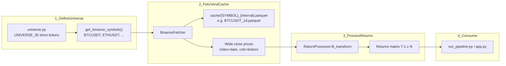

# Asset Universe Data Pipeline Playbook

This document explains how the **fixed-asset-universe data layer** in this repository works, and provides a step-by-step template for other teams to replicate the same pattern in their own projects.

**What this covers:** defining a research universe → fetching prices → caching as Parquet → building a wide price matrix → computing clean returns.

**What this excludes:** TAO subnet loaders, Taostats fetch scripts, Glosten-Harris spread estimation, and any project-specific model/backtest code downstream of returns.

---

## 1. Introduction

The `rp_pca/data` package implements a repeatable pipeline for quantitative research on a **fixed list of assets**. The design goals are:

1. **Single source of truth** — asset IDs live in one module (`universe.py`), not scattered across scripts.
2. **Local Parquet cache** — each asset is stored independently; re-runs are fast and idempotent.
3. **Wide-frame contract** — fetchers always return the same DataFrame shape so preprocessing and models stay exchange-agnostic.
4. **Configurable preprocessing** — return winsorization, missing-data rules, and date ranges live in `config.py`.

This playbook uses the **Binance 30-coin universe** (`UNIVERSE_30`) as the reference implementation. The same structure applies to equities, FX, or any other venue — swap the universe list and fetcher API, keep the contracts.

---

## 2. Architecture Overview



### Module map

| File | Responsibility |
|------|----------------|
| [`rp_pca/data/universe.py`](../rp_pca/data/universe.py) | Single source of truth for asset IDs (short tickers like `BTC`). Exposes `get_binance_symbols()` to map tickers → exchange pair symbols. Includes a runtime `assert len(UNIVERSE) == N` guard. |
| [`rp_pca/data/fetcher.py`](../rp_pca/data/fetcher.py) | Downloads OHLCV, writes one Parquet file per symbol, merges into a wide close-price DataFrame. Defaults to `get_binance_symbols()`; accepts custom `symbols=` override. |
| [`rp_pca/data/processor.py`](../rp_pca/data/processor.py) | Transforms wide prices → clean return matrix (ffill, drop sparse columns, log returns, winsorize). Shared downstream contract regardless of fetcher. |
| [`rp_pca/data/__init__.py`](../rp_pca/data/__init__.py) | Public API surface: re-exports universe, fetcher, processor. |
| [`rp_pca/config.py`](../rp_pca/config.py) | `DataConfig` holds `cache_dir`, date range, winsorization, `min_obs_fraction`. |

### Data contracts

These contracts are the **interface** between the data layer and everything downstream (PCA, backtests, dashboards). Preserve them when adapting to a new project.

| Contract | Specification |
|----------|---------------|
| **Canonical asset ID** | Short ticker string (`BTC`, `ETH`). Not the exchange pair (`BTCUSDT`). |
| **Wide price frame** | `pd.DataFrame`, shape `(T, N)`. `DatetimeIndex` named `date`, timezone-naive, sorted ascending. Columns = short tickers, values = float close prices. |
| **Parquet cache path** | `{cache_dir}/{EXCHANGE_SYMBOL}_{interval}.parquet` (e.g. `BTCUSDT_1d.parquet`). One file per symbol, not one monolithic wide file. |
| **Return matrix** | `pd.DataFrame`, shape `(T-1, N')` where `N' ≤ N` (assets with insufficient data are dropped). All values finite (no NaN/inf). Index aligned to return dates. |
| **Cache hit rule** | Reuse Parquet if file exists, `force_refresh=False`, and cached date range covers `[start_date, end_date]`. |

### Canonical pipeline wiring

From [`rp_pca/scripts/run_pipeline.py`](../rp_pca/scripts/run_pipeline.py):

```python
from rp_pca.config import Config
from rp_pca.data.fetcher import BinanceFetcher
from rp_pca.data.processor import ReturnProcessor

cfg = Config()

fetcher = BinanceFetcher(cache_dir=cfg.data.cache_dir)
prices = fetcher.fetch_all(cfg.data.start_date, cfg.data.end_date)

processor = ReturnProcessor(
    winsorize_lower=cfg.data.winsorize_lower,
    winsorize_upper=cfg.data.winsorize_upper,
    min_obs_fraction=cfg.data.min_obs_fraction,
)
returns = processor.fit_transform(prices)
```

Downstream code (covariance estimation, RP-PCA, backtest) consumes `returns.values` — never raw prices.

---

## 3. Step 1: Define Your Asset Universe

Create `your_project/data/universe.py`. This is the **only place** production asset lists should live.

### Selection criteria

When choosing assets for a fixed research universe:

- **Full sample coverage** — every asset must have price data across your estimation window (e.g. 2021-01-01 to 2025-12-31). Assets listed mid-sample will be dropped by `ReturnProcessor` unless you relax `min_obs_fraction`.
- **Liquidity** — prefer assets with consistent daily volume on your venue.
- **Stable identifiers** — use tickers that do not change (avoid rebrand confusion; e.g. `MATIC` → `POL` required an explicit universe update).
- **Fixed count** — assert the expected length so accidental edits are caught at import time.

### Reference: `UNIVERSE_30`

The current research universe in this repo (30 cryptocurrencies vs USDT on Binance):

```python
UNIVERSE_30: list[str] = [
    "BTC", "ETH", "BNB", "HYPE", "XRP", "PENDLE", "UNI", "JUP", "TAO", "LINK",
    "ZEC", "DOGE", "MORPHO", "AERO", "SOL", "AVAX", "POL", "WLFI", "WIF", "PEPE",
    "AAVE", "COMP", "FLUID", "SHIB", "SUSHI", "CRV", "SYRUP", "ENA", "ONDO", "EUL",
]

assert len(UNIVERSE_30) == 30, "Universe must contain exactly 30 assets."
```

### Template: `universe.py`

```python
"""
Asset universe definition.

<Document your selection criteria and sample period here.>
"""

# Canonical short tickers — the asset IDs used everywhere downstream
UNIVERSE_30: list[str] = [
    "BTC",
    "ETH",
    # ... add all assets ...
]

# Runtime guard: catches accidental additions/removals at import time
assert len(UNIVERSE_30) == 30, "Universe must contain exactly 30 assets."


def get_binance_symbols(quote: str = "USDT") -> list[str]:
    """Map short tickers to exchange pair symbols, e.g. ['BTCUSDT', 'ETHUSDT', ...]."""
    return [f"{ticker}{quote}" for ticker in UNIVERSE_30]
```

**Naming:** Use a descriptive constant (`UNIVERSE_EQUITY_50`, `UNIVERSE_FX_10`) if your project is not crypto. Keep the `get_*_symbols()` function name aligned with your venue (`get_nyse_symbols`, `get_oanda_symbols`, etc.).

### Symbol mapping rules

| Layer | Example | Where used |
|-------|---------|------------|
| Short ticker (canonical ID) | `BTC` | DataFrame columns, logs, benchmarks |
| Exchange pair symbol | `BTCUSDT` | API requests, Parquet filenames |
| Quote currency | `USDT` | Appended by `get_binance_symbols(quote="USDT")` |

The fetcher **always** strips the quote suffix when building the wide frame:

```python
ticker = symbol.replace("USDT", "")  # "BTCUSDT" → "BTC"
frames[ticker] = df["close"]
```

If your quote is not a simple suffix (e.g. `BRK.B` on equities), implement a dedicated `symbol_to_ticker()` mapper instead of string replacement.

### Optional metadata

You may attach metadata dicts (sector, approximate weights, listing dates). In this repo, `APPROX_MCAP_2021` exists but **keys match the legacy `UNIVERSE_30_old` list and is not used by the pipeline** — do not copy it blindly. If you need value-weighted benchmarks, either:

- pass live prices (or price × supply) into `value_weighted_returns()`, or
- maintain a metadata dict whose keys match your **current** universe exactly.

### Override for experiments

Production universes belong in `universe.py`. For one-off experiments, pass custom symbols directly to the fetcher without editing the module:

```python
fetcher = BinanceFetcher(
    cache_dir=cfg.data.cache_dir,
    symbols=["BTCUSDT", "ETHUSDT", "SOLUSDT"],
)
```

---

## 4. Step 2: Build a Fetcher with Parquet Caching

Create `your_project/data/fetcher.py`. The fetcher is responsible for:

1. Resolving the symbol list (from universe or constructor override).
2. Downloading OHLCV per symbol (with pagination for long histories).
3. Reading/writing per-symbol Parquet cache files.
4. Returning a **wide close-price DataFrame** that satisfies the contract above.

### Class skeleton

```python
from __future__ import annotations

import time
import logging
from datetime import datetime, timezone
from pathlib import Path
from typing import Optional

import pandas as pd
import requests
from tqdm import tqdm

from .universe import get_binance_symbols

logger = logging.getLogger(__name__)

BINANCE_REST = "https://api.binance.com/api/v3/klines"
MAX_LIMIT = 1000
SLEEP_BETWEEN_CALLS = 0.12  # stay under rate limits


class BinanceFetcher:
    def __init__(
        self,
        cache_dir: Path,
        symbols: Optional[list[str]] = None,
        use_ccxt_fallback: bool = True,
    ) -> None:
        self.cache_dir = Path(cache_dir)
        self.cache_dir.mkdir(parents=True, exist_ok=True)
        self.symbols = symbols or get_binance_symbols()
        self.use_ccxt_fallback = use_ccxt_fallback

    def fetch_all(
        self,
        start_date: str = "2021-01-01",
        end_date: str = "2025-12-31",
        interval: str = "1d",
        force_refresh: bool = False,
    ) -> pd.DataFrame:
        """Return wide close prices: index=date, columns=short tickers."""
        frames: dict[str, pd.Series] = {}

        for symbol in tqdm(self.symbols, desc="Fetching OHLCV"):
            ticker = symbol.replace("USDT", "")
            try:
                df = self._fetch_symbol(symbol, start_date, end_date, interval, force_refresh)
                frames[ticker] = df["close"]
            except Exception as exc:
                logger.warning("Failed for %s — %s", symbol, exc)

        prices = pd.DataFrame(frames)
        prices.index = pd.to_datetime(prices.index)
        prices.index.name = "date"
        return prices.sort_index()

    def _fetch_symbol(
        self,
        symbol: str,
        start_date: str,
        end_date: str,
        interval: str,
        force_refresh: bool,
    ) -> pd.DataFrame:
        cache_path = self.cache_dir / f"{symbol}_{interval}.parquet"

        if cache_path.exists() and not force_refresh:
            df = pd.read_parquet(cache_path)
            if (
                str(df.index.min().date()) <= start_date
                and str(df.index.max().date()) >= end_date
            ):
                mask = (df.index >= start_date) & (df.index <= end_date)
                return df.loc[mask]

        df = self._paginated_download(symbol, start_date, end_date, interval)
        df.to_parquet(cache_path)
        return df

    def _paginated_download(
        self, symbol: str, start_date: str, end_date: str, interval: str
    ) -> pd.DataFrame:
        # Paginate in chunks of MAX_LIMIT rows; advance cursor past last candle
        ...
```

### Cache path convention

```
{cache_dir}/{EXCHANGE_SYMBOL}_{interval}.parquet
```

Examples in this repo (`rp_pca/data/cache/`):

```
BTCUSDT_1d.parquet
ETHUSDT_1d.parquet
SOLUSDT_1d.parquet
```

Each file stores the **full OHLCV history** downloaded so far (not just the requested slice). On subsequent runs, the fetcher slices the cached DataFrame to `[start_date, end_date]` if the cache covers that range.

### Cache hit logic

A cache file is reused when **all** of the following are true:

1. `cache_path.exists()`
2. `force_refresh=False`
3. `df.index.min().date() <= start_date` **and** `df.index.max().date() >= end_date`

If you extend `end_date` beyond what is cached, the fetcher re-downloads and overwrites the Parquet file with the expanded range.

### REST pagination pattern

Binance (and most exchanges) cap rows per request. The reference implementation:

- Converts `start_date` / `end_date` to millisecond timestamps.
- Loops with `startTime` cursor, `limit=1000`.
- Advances cursor to `rows[-1][0] + 1` after each page.
- Sleeps `SLEEP_BETWEEN_CALLS` seconds between requests.
- Stops when a page returns fewer than `MAX_LIMIT` rows or no rows.

### Parsing klines into a DataFrame

The reference `_parse_klines` function:

- Sets index to `open_time` converted to timezone-naive dates.
- Names the index `date`.
- Keeps columns: `open`, `high`, `low`, `close`, `volume` as float.

This schema is what gets written to Parquet and what `fetch_all()` reads back for the `close` column.

### CCXT fallback (optional)

The reference `BinanceFetcher` includes a CCXT fallback for geographic API blocks or partial failures. It tries exchanges in order (`kraken`, `coinbasepro`, `bybit`, `okx`) and fills only missing symbols.

**When to keep it:** production research environments where Binance REST may be blocked.

**When to drop it:** simpler internal tools where you control network access and want fewer dependencies.

If you drop CCXT, log warnings for failed symbols and let `ReturnProcessor` drop assets with insufficient data.

### `fetch_ohlcv()` for full OHLCV

The reference fetcher also exposes `fetch_ohlcv()` returning `dict[str, pd.DataFrame]` keyed by short ticker. Use this when you need volume or high/low for benchmarks — `fetch_all()` returns closes only.

---

## 5. Step 3: Return Preprocessing

Create `your_project/data/processor.py`. `ReturnProcessor` is the shared transformation layer: every fetcher must output a wide price frame compatible with `fit_transform()`.

### Parameters

| Parameter | Default | Purpose |
|-----------|---------|---------|
| `winsorize_lower` | `0.01` | Lower percentile clip (1st) |
| `winsorize_upper` | `0.99` | Upper percentile clip (99th) |
| `min_obs_fraction` | `0.80` | Minimum fraction of non-null price rows to keep an asset |
| `use_log_returns` | `True` | Log returns vs simple `pct_change` |
| `max_fill_days` | `3` | Max consecutive days to forward-fill price gaps |

### Pipeline steps (in order)

1. **Forward-fill short gaps** — `prices.ffill(limit=max_fill_days)`. Handles brief missing candles without interpolating long outages.
2. **Drop sparse assets** — remove columns with fewer than `min_obs_fraction × T` valid observations. Sets `self.dropped_assets_` and `self.retained_assets_` for logging.
3. **Compute returns** — log: `ln(P_t / P_{t-1})`; simple: `pct_change()`. First row dropped → shape becomes `(T-1, N')`.
4. **Winsorize per column** — clip each asset's return series at `[lower, upper]` quantiles independently. Reduces impact of bad ticks and flash moves.
5. **Impute non-finite values** — replace `inf` and remaining `NaN` with `0.0` (flat return for that asset-day). Keeps downstream linear algebra finite.
6. **Drop all-NaN rows** — safety pass; should be rare after step 5.

### Template: `ReturnProcessor`

```python
class ReturnProcessor:
    def __init__(
        self,
        winsorize_lower: float = 0.01,
        winsorize_upper: float = 0.99,
        min_obs_fraction: float = 0.80,
        use_log_returns: bool = True,
        max_fill_days: int = 3,
    ) -> None:
        self.winsorize_lower = winsorize_lower
        self.winsorize_upper = winsorize_upper
        self.min_obs_fraction = min_obs_fraction
        self.use_log_returns = use_log_returns
        self.max_fill_days = max_fill_days
        self.dropped_assets_: list[str] = []
        self.retained_assets_: list[str] = []

    def fit_transform(self, prices: pd.DataFrame) -> pd.DataFrame:
        prices = prices.copy().sort_index()
        prices = prices.ffill(limit=self.max_fill_days)

        min_obs = int(self.min_obs_fraction * len(prices))
        n_valid = prices.notna().sum()
        keep = n_valid[n_valid >= min_obs].index.tolist()
        self.dropped_assets_ = [c for c in prices.columns if c not in keep]
        self.retained_assets_ = keep
        prices = prices[keep]

        if self.use_log_returns:
            returns = np.log(prices / prices.shift(1)).iloc[1:]
        else:
            returns = prices.pct_change().iloc[1:]

        returns = _winsorise_df(returns, self.winsorize_lower, self.winsorize_upper)
        returns = returns.replace([np.inf, -np.inf], np.nan).fillna(0.0)
        return returns.dropna(how="all")
```

### Introspection after fit

```python
returns = processor.fit_transform(prices)
print(f"Retained: {processor.retained_assets_}")
print(f"Dropped:  {processor.dropped_assets_}")
print(f"Shape:    {returns.shape}")
```

### Benchmark helpers (optional)

The reference `processor.py` also provides:

- `equal_weighted_returns(returns)` — cross-sectional mean → `EW_Market` series.
- `value_weighted_returns(returns, prices, supply=None)` — cap-weighted benchmark using lagged caps (avoids look-ahead).

These are not required for the data pipeline itself but are commonly used in portfolio comparison scripts.

---

## 6. Step 4: Configuration

Centralize tuneable data parameters in `your_project/config.py` so scripts and dashboards import one `DataConfig` instead of hardcoding paths.

### Template: `DataConfig`

```python
from dataclasses import dataclass
from pathlib import Path

ROOT_DIR = Path(__file__).parent
DATA_DIR = ROOT_DIR / "data" / "cache"

DATA_DIR.mkdir(parents=True, exist_ok=True)


@dataclass
class DataConfig:
    start_date: str = "2021-01-01"
    end_date: str = "2025-12-31"
    interval: str = "1d"

    winsorize_lower: float = 0.01
    winsorize_upper: float = 0.99

    cache_dir: Path = DATA_DIR
    min_obs_fraction: float = 0.80


@dataclass
class Config:
    data: DataConfig = field(default_factory=DataConfig)
    # ... model, portfolio, backtest configs ...
```

### Fields teams should mirror

| Field | Why centralize |
|-------|----------------|
| `start_date` / `end_date` | Same estimation window across fetch, backtest, and reports |
| `interval` | Must match Parquet filename suffix (`1d`, `1h`, etc.) |
| `cache_dir` | One path for dev, CI, and production overrides |
| `winsorize_lower` / `winsorize_upper` | Reproducible preprocessing |
| `min_obs_fraction` | Controls how aggressively sparse assets are dropped |

Override at runtime in CLI scripts:

```python
cfg = Config()
cfg.data.start_date = args.start
cfg.data.end_date = args.end
```

---

## 7. Step 5: Package Exports and Pipeline Wiring

### `data/__init__.py`

Expose only what downstream code needs:

```python
from .universe import UNIVERSE_30, get_binance_symbols
from .fetcher import BinanceFetcher
from .processor import ReturnProcessor

__all__ = [
    "UNIVERSE_30",
    "get_binance_symbols",
    "BinanceFetcher",
    "ReturnProcessor",
]
```

### Directory layout for a new project

```
your_project/
├── config.py                 # DataConfig + other configs
├── data/
│   ├── __init__.py           # Public exports
│   ├── universe.py           # Fixed asset list + symbol mapper
│   ├── fetcher.py            # Download + Parquet cache
│   ├── processor.py          # Prices → returns
│   └── cache/                # Local Parquet files (gitignored)
│       ├── BTCUSDT_1d.parquet
│       └── ETHUSDT_1d.parquet
└── scripts/
    └── run_pipeline.py       # End-to-end entry point
```

### Minimal smoke-test script

```python
"""scripts/fetch_smoke_test.py — verify universe → parquet → returns."""
import logging
from pathlib import Path

from your_project.config import Config
from your_project.data import BinanceFetcher, ReturnProcessor, UNIVERSE_30

logging.basicConfig(level=logging.INFO)

def main() -> None:
    cfg = Config()
    print(f"Universe: {len(UNIVERSE_30)} assets")

    fetcher = BinanceFetcher(cache_dir=cfg.data.cache_dir)
    prices = fetcher.fetch_all(cfg.data.start_date, cfg.data.end_date)

    assert prices.index.name == "date"
    assert prices.index.tz is None
    print(f"Prices: {prices.shape[0]} dates × {prices.shape[1]} assets")

    processor = ReturnProcessor(min_obs_fraction=cfg.data.min_obs_fraction)
    returns = processor.fit_transform(prices)

    assert returns.shape[0] == prices.shape[0] - 1
    assert returns.isna().sum().sum() == 0
    assert np.isfinite(returns.values).all()
    print(f"Returns: {returns.shape[0]} dates × {returns.shape[1]} assets")
    print(f"Dropped: {processor.dropped_assets_}")

if __name__ == "__main__":
    main()
```

---

## 8. Parquet File Reference

### On-disk schema

Each cached file (`BTCUSDT_1d.parquet`) contains:

| Component | Value |
|-----------|-------|
| Index | `DatetimeIndex`, name=`date`, timezone-naive |
| Columns | `open`, `high`, `low`, `close`, `volume` (all float) |
| Rows | One row per candle (daily for `interval="1d"`) |

Inspect locally:

```python
import pandas as pd
df = pd.read_parquet("rp_pca/data/cache/BTCUSDT_1d.parquet")
print(df.index.min(), df.index.max())
print(df.columns.tolist())
print(df.head())
```

### First run vs incremental refresh

| Scenario | Behavior |
|----------|----------|
| First run | Downloads all symbols, writes Parquet files, builds wide frame in memory |
| Re-run, same dates | Reads Parquet only (no network) |
| Extended `end_date` | Re-downloads symbols whose cache does not cover the new end date |
| Universe edit (add/remove ticker) | New symbols download fresh; removed symbols leave orphan Parquet files (harmless) |
| Force refresh | `fetch_all(..., force_refresh=True)` re-downloads every symbol |

### `.gitignore` guidance

Cache directories are **local artifacts**, not source code:

```gitignore
# data cache — regenerated by fetcher
**/data/cache/*.parquet
```

Commit `universe.py`, `fetcher.py`, and `processor.py`. Do not commit Parquet files.

---

## 9. Checklist for a New Project

- [ ] Universe defined in `universe.py` with `assert len(UNIVERSE) == N`
- [ ] `get_*_symbols()` tested — every mapped symbol resolves on the target exchange
- [ ] Fetcher writes and reads per-symbol Parquet at `{cache_dir}/{SYMBOL}_{interval}.parquet`
- [ ] `fetch_all()` returns wide frame: `index.name == "date"`, timezone-naive, columns = short tickers
- [ ] `ReturnProcessor.fit_transform()` produces finite `(T-1, N')` matrix with no NaN/inf
- [ ] `DataConfig` centralizes dates, cache path, winsorization, and `min_obs_fraction`
- [ ] `data/__init__.py` exports the public API
- [ ] Smoke-test script runs end-to-end without manual steps
- [ ] `data/cache/` added to `.gitignore`

---

## 10. Troubleshooting and Common Pitfalls

### Ticker vs pair symbol confusion

**Symptom:** DataFrame columns named `BTCUSDT` instead of `BTC`; downstream benchmark lookup for `BTC` fails.

**Fix:** Strip the quote suffix when building the wide frame. Keep pair symbols only in API calls and Parquet filenames.

### Timezone-aware index

**Symptom:** Misaligned merges, off-by-one date errors, or parquet round-trip warnings.

**Fix:** Normalize to timezone-naive dates after parsing:

```python
df.index = df.index.normalize().tz_localize(None)
df.index.name = "date"
```

### Asset in universe but not on exchange

**Symptom:** Fetcher logs warnings; asset missing from wide frame or column is all-NaN.

**Fix:** Verify listing on the venue before adding to universe. `ReturnProcessor` will drop columns below `min_obs_fraction`. For newly listed coins, lower `min_obs_fraction` or shorten the sample window.

### Stale cache after universe edit

**Symptom:** Old ticker still appears, or new ticker not fetched despite being in universe.

**Fix:** Delete affected Parquet files or pass `force_refresh=True`. Orphan files for removed tickers do not affect `fetch_all()` but can be deleted manually.

### `min_obs_fraction` too strict

**Symptom:** Many assets in `processor.dropped_assets_`; return matrix has few columns.

**Fix:** Lower threshold (e.g. `0.50` for assets with staggered listing dates) or restrict the universe to assets with full-history coverage.

### Partial fetch silent failures

**Symptom:** Wide frame has fewer columns than universe with only log warnings.

**Fix:** After `fetch_all()`, assert expected coverage:

```python
missing = set(UNIVERSE_30) - set(prices.columns)
if missing:
    raise RuntimeError(f"Missing price data for: {sorted(missing)}")
```

### Column order non-determinism

**Symptom:** Reproducibility issues across runs when iterating dict keys.

**Fix:** The reference fetcher builds `pd.DataFrame(frames)` from a dict (column order follows fetch loop order). For strict reproducibility, reorder: `prices = prices[sorted(prices.columns)]` or `prices = prices[UNIVERSE_30]` (intersected with available columns).

---

## 11. Reference Implementation

| File | Description |
|------|-------------|
| [`rp_pca/data/universe.py`](../rp_pca/data/universe.py) | `UNIVERSE_30` definition, `get_binance_symbols()`, length assertion |
| [`rp_pca/data/fetcher.py`](../rp_pca/data/fetcher.py) | `BinanceFetcher` with REST pagination, Parquet cache, CCXT fallback |
| [`rp_pca/data/processor.py`](../rp_pca/data/processor.py) | `ReturnProcessor` pipeline and benchmark return helpers |
| [`rp_pca/data/__init__.py`](../rp_pca/data/__init__.py) | Package public API |
| [`rp_pca/config.py`](../rp_pca/config.py) | `DataConfig` defaults and `DATA_DIR` path |
| [`rp_pca/scripts/run_pipeline.py`](../rp_pca/scripts/run_pipeline.py) | Production wiring: fetch → process → model |

### Related documentation

- [`docs/PRINCIPAL_COMPONENTS_TECHNICAL.md`](PRINCIPAL_COMPONENTS_TECHNICAL.md) — how the return matrix feeds PCA/RP-PCA (downstream of this pipeline).
- [`README.md`](../README.md) — project overview and quick start.

---

## Quick reference: end-to-end flow

```
universe.py          define UNIVERSE_30 + get_binance_symbols()
       ↓
fetcher.py           BinanceFetcher.fetch_all() → wide close prices (T × N)
       ↓              cache: {cache_dir}/{SYMBOL}_1d.parquet
processor.py         ReturnProcessor.fit_transform() → returns ((T-1) × N')
       ↓
downstream           covariance, RP-PCA, backtest, dashboard
```

Copy the four modules (`universe.py`, `fetcher.py`, `processor.py`, `__init__.py`), adapt the universe and API client, keep the contracts — and any team can stand up the same data pipeline for their use case.
